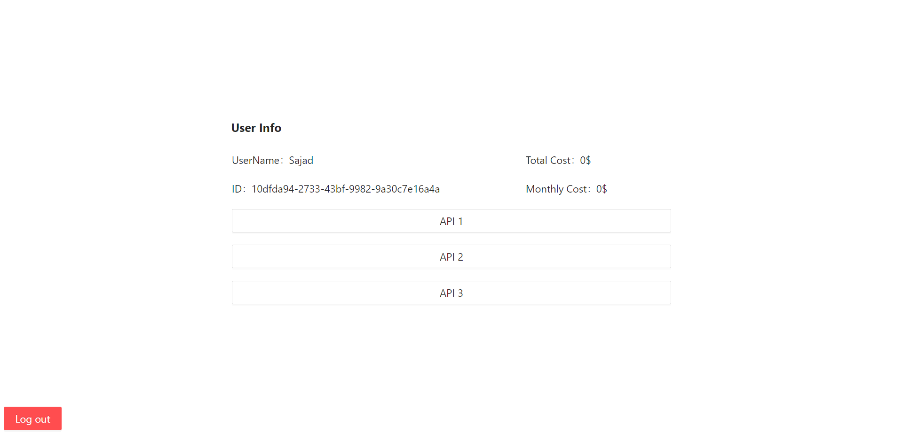

# Basic Pay-as-you-go service
A simple pay-as-you-go service charging user as they use APIs.

## Description

Backend development is the main focus in this project, so there is almost no field validation in Frontend. all fields are heavily check in backend using relevant serializers and in case of any error, notifications will be shown expressing the problem.

## Getting Started with Docker

### Dependencies

* Docker version 20.10 or higher (lower might also work)
* Docker compose version 2.15 or higher (lower might also work)
<br/>

I strongly suggest to use docker as it would make tasks like superuser creation, migrations, database connections and many more automated. The whole setup process would take less than a couple of minutes if you have a decent internet connection.

### Preparing

* Clone project
```
git clone https://github.com/9Knight9n/PAYG-Service.git
```
* Change directory into cloned folder
```
cd PAYG-Service
```
* Create .env file from example.env file
```
cp .env.example .env
```
* You may change .env file to customize ports, passwords and switch between production and development environments
### Running
* Run project with docker compose
```
docker compose up
```
* Visit http://localhost:3000/ to start

## Getting Started without Docker
Here are some instructions to run project outside docker environment in case you really had to. note that only backend would run and there won't be any frontend to check APIs (you can use postman with exported postman files instead) and neither an external database (it automatically switches to sqlite3 when not in docker environment).  

### Dependencies

* Python version 3.10 (lower or higher might also work)
* Pip version 23.2 (lower or higher might also work)

### Preparing

* Clone project
```
git clone https://github.com/9Knight9n/PAYG-Service.git
```
* Change directory into backend folder
```
cd PAYG-Service/django
```
* Install dependencies
```
pip install -r requirements.txt
```
* Make database migrations
```
python manage.py makemigrations
```
* Apply database migrations
```
python manage.py migrate
```

### Running
* Run project's backend
```
python manage.py runserver
```
* Use postman export files provided in postman folder to check APIs


## In-depth

### Requirements & Solutions
Here are some of the required functionalities for this project and the solutions provided to meet them.
* User Registration and Authentication: Users should be able to register and create accounts on the platform.
>We used knox auth library to provide token based authentication for all APIs.
* Request Tracking: Each user's request count should be stored in the database. The platform should increment the request count each time a user makes a request.
>We used a middleware to save API calls.
>Instead of just saving the request count in User model, we followed a different approach which was to save count of each API call by each user at each month in a table called Record, doing so had provided us the following benefits:
>* ability to calculate user monthly cost
>* ability to use different costs for different APIs
* Cost Calculation: Implement a mechanism to calculate the total cost for each user based on their request count. The cost per request should be $0.001. The total cost for each user should be stored in the database and updated accordingly.
>Calculating monthly cost is easy using the data in Record table. User's total cost is a derived variable and can be derived from Record table but since it was specified by requirement to save it in database, it was added as a field of User model.   
* API for Users to View Current Cost: Develop an API endpoint that allows users to retrieve their current cost for the current month. Users should be able to make authenticated requests to this API to get their cost information
>An API with token authentication is provided for this requirement.

### Challenges
* Race condition when increasing the counter for API call: We used Django f-expressions to resolve any race condition by executing the increment in database. 
* Auto add API usage to records: we utilized Django middlewares to resolve this challenge.

### Services
Services used in application
* Django: Back-end framework
* PostgreSQL: Database
* React.js: Front-end framework


### Tasks
- [x] Initialize Django
- [x] Dockerize Django and PostgreSQL
- [x] Added Authentication (using django Knox auth)
- [x] Create User Model and with its serializer
- [x] Add auto superuser creator script 
- [x] Add auto Migration script
- [x] Add Record model
- [x] Create and add Middleware to log API calls to Record table
- [x] Add some utils in utils.py
- [x] Add some random APIs as pay-as-you-go APIs
- [x] Test functionalities 
- [x] Export created API to a postman export file
- [x] Initialize React.js
- [x] Dockerize React.js
- [x] Add Login and Signup page
- [x] Add Home page
- [x] Create readme
- [ ] Create Production versions of Dockerfiles
- [ ] Optimize requirements.txt file and remove unnecessary packages


### further improvement
Here are some suggestions for performance improvement which were omitted from this project since they were over-committing for a sample project. 
* We could convert created middleware to an async middleware to decrease APIs response time since APIs won't be waiting for logging process.  
* Or We could assign Logging process to a different thread and utilize bulk insertion to increase performance even more. (as suggested by DRF-API-Logger library)

### Screenshots




